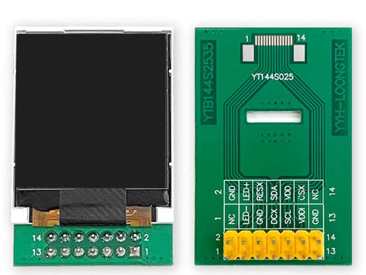
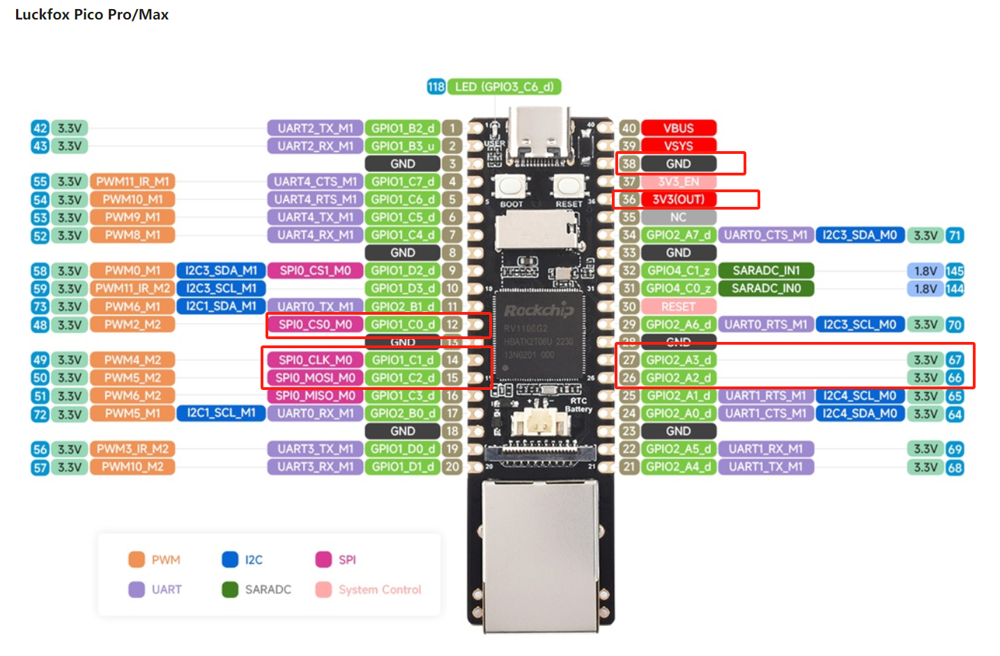
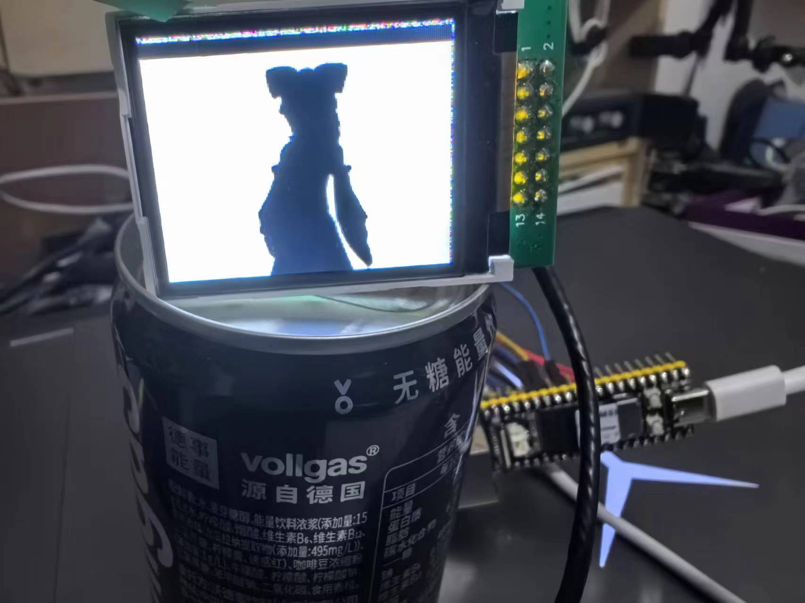
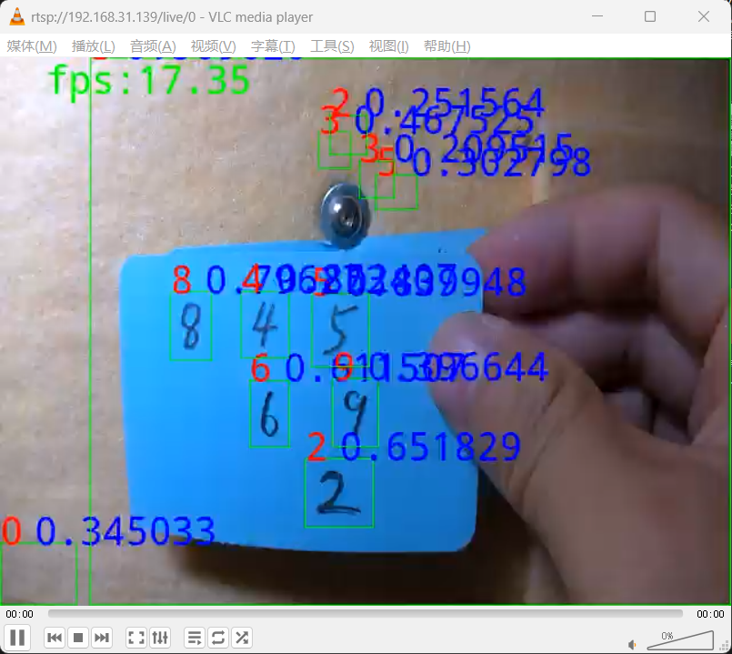

# RV1106_Linux
Linux test for RV1106 dev board

## v4l2
> 1. class v4l2CapPicTool is a tool for capturing picture;

### linux config
```
CONFIG_SCSI=y
CONFIG_BLK_DEV_SD=y
CONFIG_SCSI_UFSHCD=y
CONFIG_MEDIA_USB_SUPPORT=y
CONFIG_USB_VIDEO_CLASS=y
CONFIG_USB_EHCI_HCD=y
CONFIG_USB_STORAGE=y
CONFIG_USB_MASS_STORAGE=y
```

### linux dts
```
/**********USB**********/
&usbdrd_dwc3 {
	status = "okay";
	dr_mode = "host";
};
```

### compile
```
cd v4l2
mkdir build
cd build
cmake ..
make
```

### time cost 
```
capture time spent: 0.02077100 sec
save time spent: 0.00305000 sec
capture time spent: 0.01992500 sec
save time spent: 0.00133800 sec
capture time spent: 0.01959500 sec
save time spent: 0.00224100 sec
capture time spent: 0.02186700 sec
save time spent: 0.00239300 sec
capture time spent: 0.01873900 sec
save time spent: 0.00181500 sec
capture time spent: 0.01912700 sec
save time spent: 0.00134600 sec
capture time spent: 0.01973400 sec
save time spent: 0.00308300 sec
capture time spent: 0.01959300 sec
save time spent: 0.00237300 sec
capture time spent: 0.01859000 sec
save time spent: 0.00310700 sec
capture time spent: 0.01985500 sec
save time spent: 0.00120300 sec
capture time spent: 0.01963000 sec
save time spent: 0.00225200 sec
capture time spent: 0.02174400 sec
save time spent: 0.00238600 sec
capture time spent: 0.01873300 sec
save time spent: 0.00179200 sec
```
So, frequency of capture with usb camera can reach 50Hz.

## framebuffer

### linux config
```
CONFIG_FB_TFT=y
CONFIG_FB_TFT_ST7735R=y
```

### linux dts
> rv1106g-luckfox-pico-pro-max.dts

### connect



| st7735 | pico |
|-------|-------|
| LED- | PICO-GND |
| LED+ | PICO-3.3V |
| RESX | PICO-PIN27 |
| DCX | PICO-PIN26 |
| SCL | PICO-PIN14 |
| SDA | PICO-PIN15 |
| VDDI | PICO-3.3V |
| VDD | PICO-3.3V |
| VDD | PICO-PIN12 |

### test
> st7735test.c

`arm-linux-gnueabihf-gcc -o st7735test st7735test.c`

### badapple

`sudo ffmpeg -v 60 -i bad-apple-160x128-4.mp4 -pix_fmt rgb565le -f fbdev /dev/fb0`



## MNIST

### build
```
cd MNIST
mkdri build
cd build
cmake ..
make
make install
scp -r ../rtsp_mnist_test root@xxx.xxx.xxx.xxx:~
```

### run
```
killall rkipc
cd rtsp_mnist_test
./rtsp_mnist_test model/mnist.rknn
```

### rtsp
`rtsp://192.168.31.139/live/0`

